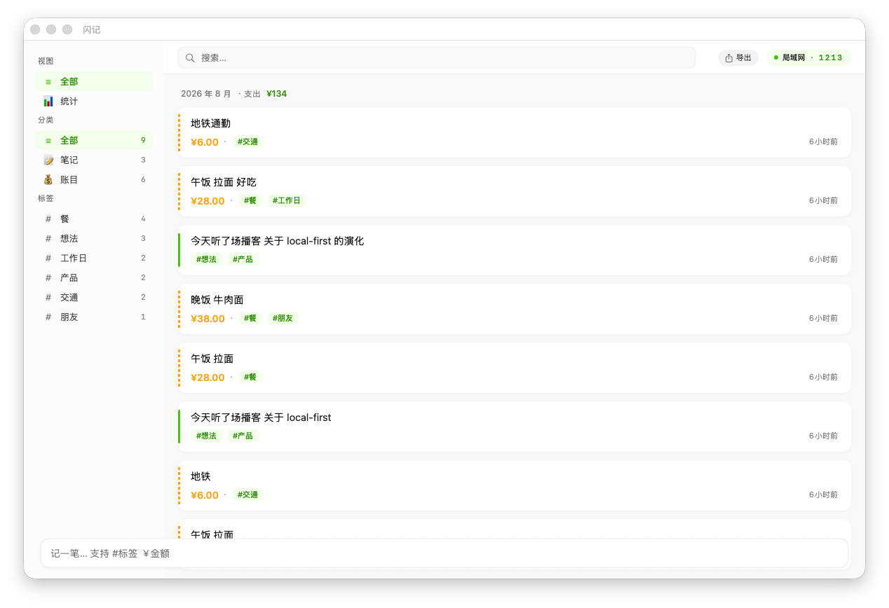

# 闪记 FlashNote

白绿配色的卡片式快速记录工具。**Mac 原生 app + 任意浏览器 Web 端**，局域网内自动同步。文字笔记与简单账目一套搞定。

单用户 · 无云 · 无账号 · 跨设备即开即用。



## 5 秒上手

```bash
# 1. 启动 Mac 端（数据源 + HTTP server）
cd mac && swift run

# 2. iPhone / iPad / 桌面浏览器打开
http://<mac-ip>:9527/
# 输 Mac 顶栏 4 位配对码 → 同步完成
```

> 配对码每次成功配对后自动 rotate。一码一设备。

## 端形态

| 端 | 技术 | 角色 |
| --- | --- | --- |
| **Mac app** | SwiftUI + AppKit | 数据源 + HTTP server (port 9527) + mDNS 广播 + 静态文件服务 |
| **Web 端** | 原生 ES6 + CSS（零框架） | 任意浏览器（iPhone Safari / 桌面 Chrome / iPad…）即开即用 |
| ~~小程序~~ | — | 砍掉（v2 转向） |

**所有数据存在 Mac 本地 JSON**（`~/Library/Application Support/FlashNote/records.json`）。Web 端只是视图层，localStorage 缓存。


## 核心功能

### Mac app（SwiftUI）
- 快速记录：Cmd+N 唤起浮层 / 底部输入条
- 一句话解析：自动识别金额、#标签
- 卡片流（按月分组 + 月支出小计）
- 侧边栏：全部 / 笔记 / 账目 / 标签筛选
- 搜索（全文 + 标签）
- 统计页：本月大数字 / 分类占比（donut）/ 最近 7 天 / 热门标签
- 导出：Markdown / CSV / JSON
- 编辑（点卡片）
- 局域网同步服务（mDNS + HTTP）

### Web 端
- 记录 / 统计 双 tab
- 一句话输入（底部固定输入条）
- 卡片流（按月分组 + 月支出小计）
- 搜索（content / #tag / 金额）
- 点击 `#tag` 自动填到搜索框筛选
- 编辑卡片（点卡片 → 底部 sheet → 实时预览 → 保存）
- 长按删除（800ms 进度条，避免误删）
- 离线队列（断网时本地缓存，联网自动重发）
- PWA：可「加到主屏」
- 自动同步（新增/删除/编辑/online 事件触发）


## 一句话解析规则

| 部分 | 匹配规则 | 解析结果 |
| --- | --- | --- |
| 金额 | `¥28` / `28元` / `28` | 28.0 |
| 标签 | `#xxx` | `["餐", "工作日"]` |
| 剩余文本 | — | "午饭 拉面" |
| 类型推断 | 有金额 → 账目，否则 → 笔记 | expense |

例：`午饭 拉面 28 #餐 #工作日` → content="午饭 拉面" / amount=28 / tags=[餐, 工作日] / type=expense

## 跨设备同步

```
┌──────────┐  mDNS / 9527  ┌──────────┐
│ Mac app  │◄─────────────►│ Web 端   │  ← iPhone Safari / 桌面 Chrome / 任何
│ (数据源) │   HTTP + LWW   │ (浏览器) │
└──────────┘                └──────────┘
```

- **发现**：Mac 端 Bonjour 广播 `_flashnote._tcp`；Web 端需要用户输入 Mac IP（浏览器不能直接 mDNS 查询）
- **配对**：Mac 顶栏 4 位配对码（一次性，配对后自动 rotate）
- **认证**：Bearer token，存 Web 端 localStorage
- **同步**：增量 LWW（按 `updatedAt`）；Web 端用服务端时钟作游标
- **冲突**：Last-Write-Wins

详见 [`protocol/api.md`](./protocol/api.md)。

## 端到端演示

**Web → Mac 同步**（iPhone Safari 输一条，Mac 端几秒内出现）：


**搜索 + 标签筛选**（点 `#餐` 自动筛选）：


**离线状态**（断网时橙色 pill + 联网自动重发）：


## 目录

```
FlashNote/
├── DESIGN.md              # 完整产品设计文档
├── mac/                   # Mac 端（SwiftUI + HTTP server + 静态文件服务）
│   └── README.md          # Mac 端详细说明
├── web/                   # Web 端（mobile-first 单页，PWA）
│   ├── index.html
│   ├── css/  js/  manifest.json  sw.js
│   └── images/
├── brand/                 # logo（卡片 + 闪电）
├── protocol/api.md        # 同步协议规约
├── prototype/             # v1 HTML 设计原型
└── docs/screenshots/      # 文档截图
```

## 开发

```bash
# Mac 端
cd mac
swift build              # build
swift run                # 启动
swift test               # 跑测试

# Web 端
# web/ 改完直接刷新浏览器即可（service worker network-first）
# 但 Mac 跑的是 build 进去的 web/，要改 mac bundle：
rm -rf mac/Sources/FlashNote/Resources/web
cp -r web/ mac/Sources/FlashNote/Resources/web/
cd mac && swift build
```

## 不做的东西

- ❌ 收入记录
- ❌ 多用户 / 账号系统
- ❌ 微信小程序 / 独立 App
- ❌ 云同步、登录、注册

## License

MIT
